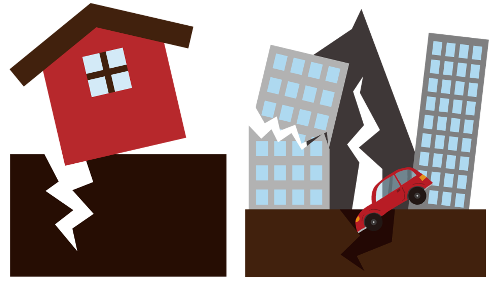

# Earthquake_Risk_Prediction

Look at the [app](https://earthquakeriskprediction.streamlit.app/) 

Forecasting earthquakes is one of the most challenging job because they don't show specific patterns resulting by predictions. An earthquake is a natural disaster based on a shaking of Earth’s surface, and caused by a sudden slip on a fault. It releases energy in waves that travel through the Earth's crust. A big earthquake can inflict massive death and huge infrastructural damages with also huge losses for Insurance/Reinsurance Companies. Predicting the occurences of an earthquake, losses can be reduced. Current scientific studies linked to earthquake forecasting focus on three key points:

-when the event will happen,

-where it will happen,

-and how large it will be.

The purpose of this job is to predict the magnitude of the next earthquakes in the following period by the help of Supervised Learning models.

In order to manage the uncertainity linked with the prediction is used the quantile loss and in this way there will be a prediction interval for each estimation. Indeed, predicting the lower and upper quantiles of the target then will be able to have a "trust region" in between which the true value is likely to belong. The analysis end with the study about features that have considered relevant for the outcome.
